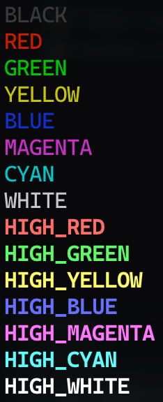

# PyMudClient: 用 Python 開發的 MUD Client 核心

## 這是什麼？

- MUD, Multi-User Dungeon，是多人即時虛擬類遊戲，通常以文字描述為基礎。
- 此 library 的目的是提供一個 MUD Client 核心，讓人可透過 Python 方便的使用 Trigger, Timer, Alias, Variable 功能來遊玩 MUD game。

---

- [PyMudClient: 用 Python 開發的 MUD Client 核心](#pymudclient-用-python-開發的-mud-client-核心)
  - [這是什麼？](#這是什麼)
  - [支援功能](#支援功能)
  - [安裝](#安裝)
  - [使用範例](#使用範例)
  - [輸入介面](#輸入介面)
  - [API Reference](#api-reference)
    - [PyMudClient](#pymudclient)
  - [pre\_process\_recv\_content\_func](#pre_process_recv_content_func)
    - [function prototype](#function-prototype)
    - [使用範例](#使用範例-1)
    - [Alias](#alias)
      - [Alias class 說明](#alias-class-說明)
      - [使用範例](#使用範例-2)
    - [Trigger](#trigger)
      - [Trigger class 說明](#trigger-class-說明)
      - [使用範例](#使用範例-3)
    - [Timer](#timer)
      - [Timer class 說明](#timer-class-說明)
      - [使用範例](#使用範例-4)
  - [Variable Map](#variable-map)
    - [使用範例](#使用範例-5)
  - [color\_print](#color_print)
    - [使用範例](#使用範例-6)
  - [MudColorAlias](#mudcoloralias)
    - [常數](#常數)
    - [使用範例](#使用範例-7)
  - [License](#license)

## 支援功能

- Terminal 的 encoding 使用 UTF-8，不需要特別調整。
- 連線：根據輸入的 host 跟 port 進行連線。
- 斷線重連：發生異常、server 重新啟動導致的斷線，會自動重新連線。
- 顯示：顯示 server 回傳的內容。
  - 有處理輸入中文的顯示問題。
  - 只針對萬王之王 (kk.muds.idv.tw:4000) 進行測試過。
- 輸入介面：支援中文輸入、剪貼簿操作、游標移動、指令編輯等功能。
- Alias：建立指令別名，可以把複雜的指令簡化成短指令，送出指令或者執行 function，支援參數替換。
- Trigger：觸發器。從 server 接收到的內容中有符合 regex 的話，可以自動傳送指令或者執行 function。
- Timer：固定秒數送出指令或者執行 function。
- Variable：可以建立常用變數，在 Trigger, Alias, Timer 內要送指令到 server 時使用。
- color_print: 可以印出帶有顏色的文字的 function，使用 MUD 的顏色字串，可搭配 MudColorAlias 使用。
- MudColorAlias: 提供在 MUD 內常用來定義顏色的字串。

## 安裝

`pip install pymudclient`

## 使用範例

```py
import settings
from aliases import ALIAS_LIST
from pymudclient import PyMudClient
from timers import TIMER_LIST
from triggers import TRIGGER_LIST
from variable_map import VARIABLE_MAP


def main():
    mud = PyMudClient(
        host=settings.HOST,
        port=settings.PORT,
        account=settings.ACCOUNT,
        password=settings.PASSWORD,
        alias_list=ALIAS_LIST,
        trigger_list=TRIGGER_LIST,
        timer_list=TIMER_LIST,
        variable_map=VARIABLE_MAP,
        encoding='big5hkscs',
    )
    mud.run()


if __name__ == '__main__':
    main()
```

## 輸入介面

- 可輸入中文字。
- 從剪貼簿貼上可正常使用。
- 輸入的文字會固定出現在最後一行，此時按下 Enter 可以再次送出。
- 可使用 左/右/Home/End 移動位置。
- 可使用 Backspace/Ctrl-H 刪除游標位置前面的字元。
- 可使用 Delete 刪除游標位置後面的字元。
- 可使用 Ctrl-W 刪除前面一個 word (仿照 terminal 中操作的方式)。
- 按下 Enter 送出後，會記住最後一次送出的文字，可以進行編輯，或直接按 Enter 再送一次。

## API Reference

### PyMudClient

- PyMudClient 的主體

```py
PyMudClient.__init__(
    self,
    host: str,
    port: int,
    account: str | None = None,
    password: str | None = None,
    alias_list: list[Alias] | None = None,
    trigger_list: list[Trigger] | None = None,
    timer_list: list[Timer] | None = None,
    variable_map: dict[str, str] | None = None,
    pre_process_recv_content_func: Callable[[str], str] | None = None,
    encoding: str = 'latin1',
)
```

- host: 連線的主機網址或 IP。
- port: 連線的主機 port。
- account: (optional) 帳號，會以 'ACCOUNT' 加入 variable_map，可在 trigger 用來送出帳號。
- password: (optional) 密碼，會以 'PASSWORD' 加入 variable_map，可在 trigger 用來送出密碼。
- alias_list: (optional) Alias 清單，參考 [Alias](#alias)。
- trigger_list: (optional) Trigger 清單，參考 [Trigger](#trigger)。
- timer_list: (optional) Timer 清單，參考 [Timer](#timer)。
- variable_map: (optional) 變數 dict，參考 [Variable Map](#variable-map)。
- pre_process_recv_content_func: (optional) 從 server 接收到內容後會先呼叫這個 function 再根據回傳的結果顯示到畫面上，參考 [pre_process_recv_content_func](#pre_process_recv_content_func)。
- encoding: (optional) server 內容的編碼，例如 `big5hkscs`。

## pre_process_recv_content_func

### function prototype

```py
def pre_process_recv_content_func(content: str) -> str:
    ...
```

- 從 server 接收到內容後會先呼叫這個 function 再根據回傳的結果顯示到畫面上。
- 傳入 content，回傳修改後的 content。
- 舉例來說，KK 的 server 有時會有 `\x1B[1m` 的文字插在 `big5hkscs` 中文字的 2 個 bytes 之間，導致中文字沒辦法被正確的處理，可以利用這個 function 移除。

### 使用範例

```py
def remove_strange_color_code(content: str) -> str:
    '''移除中文字 2 個 byte 中間會被插入的 \x1B[1m (會導致中文字變亂碼)'''
    new_content = ''

    status = 0
    content_length = len(content)
    for i in range(content_length):
        if status == 0:
            new_content += content[i]
            # Big5 的範圍才要處理
            value = ord(content[i])
            if 0x81 <= value and value <= 0xFE:
                status = 1

        elif status == 1:
            if (i + 3 < content_length and all([
                    ord(content[i]) == 0x1B,
                    ord(content[i + 1]) == ord('['),
                    ord(content[i + 2]) == ord('1'),
                    ord(content[i + 3]) == ord('m'),
            ])):
                status = 2
                skip = 3
            else:
                new_content += content[i]
                status = 0

        elif status == 2:
            skip -= 1
            if skip == 0:
                status = 0

    return new_content
```

### Alias

#### Alias class 說明

```py
@dataclass
class Alias:

    start_text: str
    pattern: str | None = None
    func: Callable | None = None
```

- start_text: Alias 的指令，可以包含空格。
- pattern: (optional) 要替換的指令，會傳到 server。
- func: (optional) 要呼叫的 function。
  - function prototype:
    ```py
    def func(text: str) -> str or None:
      ...
    ```
  - `text` 參數會把除了 start_text 外的後面的文字全部傳入。
  - 如果 function 有回傳文字，會傳給 server；如果沒有要傳送給 server 的指令，不要回傳就好。

pattern 跟 func 2 選 1。

#### 使用範例

```py
from pymudclient import Alias

ALIAS_LIST = [
    Alias('kk', pattern='kingdom %0'),
    Alias('c', pattern='cast %1 on %2'),
    Alias('draw', pattern='draw %1 %-1'),
]
```

- pattern 中的 %0 為全部參數。以上面的例子，`kk 安安 你好 123`，`%0` 就是 `安安 你好 123`。
- pattern 中的 %1 ~ %n 為第 1 ~ 第 n 個參數。以上面的例子，`c fire stone`，`%1` 就是 `fire`；`%2` 就是 `stone`。
- pattern 中的 %-1 為去掉第 1 個參數後的其他所有參數；%-2 為去掉第 2 個參數後的其他所有參數；以此類推。以上面的例子，`draw board ABCD 1234`，`%-1` 就是 `ABCD 1234`。

### Trigger

#### Trigger class 說明

```py
@dataclass
class Trigger:

    pattern: str
    data: str | None = None
    func: Callable | None = None
```

- pattern: 觸發的 pattern，使用 regex。
- data: (optional) 要直接送出的文字，如果是固定文字用這個就好。
- func: (optional) 要呼叫的 function。
  - function prototype:
    ```py
    def func(text: str, match_group: list) -> str or None:
        ...
    ```
  - `text` 參數會把有符合 trigger 條件的整行文字傳入。
  - `match_group` 參數會把 regex match 到的 `match.groups()` 傳入
  - 如果 function 有回傳文字，會傳給 server；如果沒有要傳送給 server 的指令，不要回傳就好。
- data 跟 func 2 選 1。

#### 使用範例

```py
from pymudclient import Trigger

def summon(text, match_group):
    return f'summon {match_group[0]}'

TRIGGER_LIST = [
    Trigger(r"^您的英文名字\(新人物請輸入\'new\'\) :$", data='${ACCOUNT}'),
    Trigger(r"^請輸入密碼﹕$", data='${PASSWORD}'),
    Trigger(r'\(([a-zA-Z]+)\)告訴你﹕sum$', func=summon),
]
```

- 前面 2 個是輸入帳號密碼的 trigger，裡面的 ${ACCOUNT} 及 ${PASSWORD} 會使用傳給 PyMudClient 的 account 及 password。
- 第 3 個是幫忙把人招喚過來的 trigger，有抓取角色 id `([a-zA-Z]+)`。

### Timer

#### Timer class 說明

```py
@dataclass
class Timer:

    seconds: int
    data: str | None = None
    func: Callable | None = None
```

- seconds: 多久執行一次，單位是秒。
- data: (optional) 要直接送出的文字，如果是固定文字用這個就好。
- func: (optional) 要呼叫的 function。
  - function prototype:
    ```py
    def func() -> str or None:
      ...
    ```
  - 如果 function 有回傳文字，會傳給 server；如果沒有要傳送給 server 的指令，不要回傳就好。
- data 跟 func 2 選 1。

#### 使用範例

```py
from datetime import datetime

from pymudclient import (
    MudColorAlias,
    Timer,
    color_print,
)


def print_time():
    color_print(f'{MudColorAlias.HIGH_CYAN}{datetime.now()}{MudColorAlias.NORMAL}')

TIMER_LIST = [
    Timer(900, data='save'),
    Timer(60, func=print_time),
]
```

- 第一個 Timer 是每 900 秒傳送一個 `save` 到 server。
- 第二個 Timer 是每 60 秒呼叫一次 print_time 這個 function。
  - print_time 內使用到的 color_print 以及 MudColorAlias 的目的是印出帶有顏色的文字，參考下面的 [color_print](#color_print) 跟 [MudColorAlias](#mudcoloralias) 說明。

## Variable Map

- 型別：`dict[str, str]`
- 可以建立常用變數，在 Trigger, Alias, Timer 內要送指令到 server 時使用。
- 變數使用格式：`${變數名}`，例如 `${ACCOUNT}` 會被替換為對應的值。

### 使用範例

```py
VARIABLE_MAP = {
    'DO_RE_MI': '霹靂卡霹靂拉拉波波力那貝貝魯多'
}

ALIAS_LIST = [
    Alias('doremi', pattern='sing ${DO_RE_MI}'),
]
```

- 當輸入 `doremi` 時，就會傳送 `sing 霹靂卡霹靂拉拉波波力那貝貝魯多` 到 server

## color_print

- 可以印出帶有顏色的文字，可搭配 MudColorAlias 使用。

### 使用範例

```py
from datetime import datetime

from pymudclient import (
    MudColorAlias,
    color_print,
)


color_print(f'$HIY${datetime.now()}$NOR$')
```

- 這邊的 `$HIY$` 跟 `$NOR$` 是 MUD 內常用來定義顏色的字串，雖然不難記，但也可以直接使用 [MudColorAlias](#mudcoloralias)。
- 開頭使用 `$HIY$` 讓顏色切換成高亮黃色，所以接下來的文字都會變成高亮黃色顯示，結尾的 `$NOR$` 是讓顏色變回預設顏色。

## MudColorAlias

- 提供在 MUD 內常用來定義顏色的字串。
- 注意：實際上在 terminal 顯示的顏色會根據 terminal 設定而改變。

### 常數

- NORMAL: 重置為正常顏色
- BLACK: 黑色
- RED: 紅色
- GREEN: 綠色
- YELLOW: 黃色
- BLUE: 藍色
- MAGENTA: 洋紅色
- CYAN: 青色
- WHITE: 白色
- HIGH_RED: 高亮紅色
- HIGH_GREEN: 高亮綠色
- HIGH_YELLOW: 高亮黃色
- HIGH_BLUE: 高亮藍色
- HIGH_MAGENTA: 高亮洋紅色
- HIGH_CYAN: 高亮青色
- HIGH_WHITE: 高亮白色



### 使用範例

```py
from datetime import datetime

from pymudclient import (
    MudColorAlias,
    color_print,
)


color_print(f'{MudColorAlias.HIGH_CYAN}{datetime.now()}{MudColorAlias.NORMAL}')
```

## License

[MIT](https://github.com/griiid/PyMudClient/blob/master/LICENSE)
